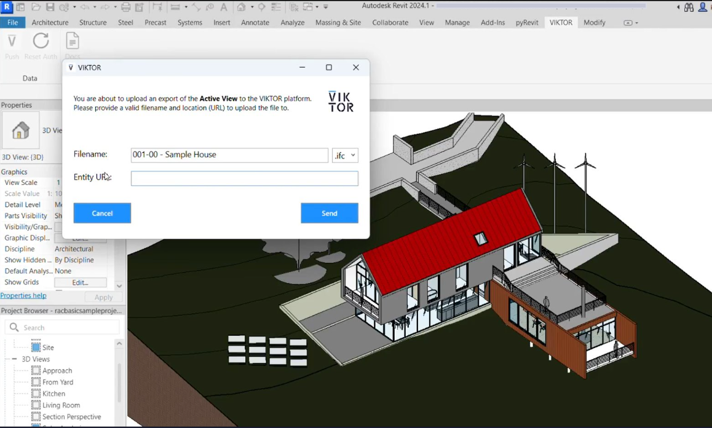
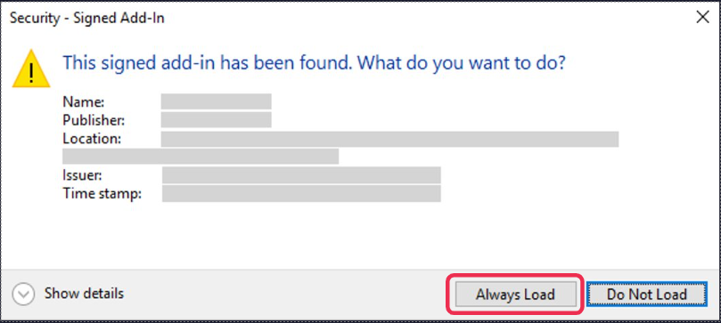
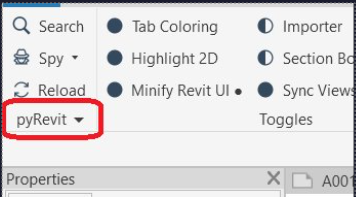
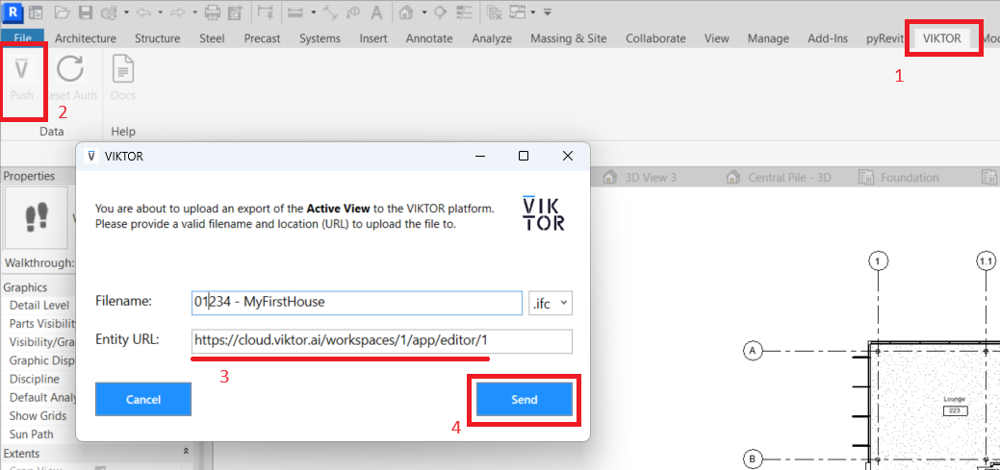

# pyrevit-plugin
A VIKTOR Plugin that can be installed and used within Revit, to transfer data between the VIKTOR Platform and Autodesk Revit.

> [!IMPORTANT]  
> This plugin is a **prototype**; a Minimum Viable Product that showcases the opportunities for data exchange between the VIKTOR Platform and Revit. 
> Please be aware that it is not feature-complete and might be updated in the future, based on the feedback that we're gathering.



## Getting started

### Installation

1. Install Revit2024 or lower
2. Install pyRevit:
   - Download installer: [pyRevit_4.8.16.24121](https://github.com/pyrevitlabs/pyRevit/releases/download/v4.8.16.24121%2B2117/pyRevit_4.8.16.24121_signed.exe)
   - Run installer and follow steps
   - Launch Revit, this should trigger pop-up modal for PyRevit addin, select "Always Load"
   
     
3. Navigate to pyRevit Settings:
   - Navigate to pyRevit tab, 
   - Click pyRevit dropdown button (bottom-left in the ribbon)
   
     
   - Click Settings
   - Navigate to 'Custom Extension Directories' (bottom)
4. Add the directory this repo folder, and save the settings
   - Make sure to select the top repo folder and not the 'VIKTORPlugin.extension' folder
5. You should get a similar pop-up, about the new VIKTOR Plugin. Once again, click 'Always Load'.
6. You should now see a VIKTOR tab appear. This concludes the installation.

### Usage

To 'push' your model through the Revit Plugin to the VIKTOR Platform, first open your model in Revit and make sure to select the relevant view, then:
1. Go to the VIKTOR tab
2. Press the "Push" button
3. Provide the URL to the entity (copy the url in your browser navigation bar)
4. Press send! 🚀



## Contribute
Feel free to re-use and/or improve this plugin for your own projects. Below are some useful things to know, should you want to add more functionality.

### Structure

Note that the structure of the repo and the corresponding filenaming system directly affects the layout of how the tab, panel and buttons are defined
in the VIKTOR addin tab.

```
.
└── VIKTORPlugin.extension/
    ├── VIKTOR.tab/
    │   ├── some_group.panel/
    │   │   ├── some_action.pushbutton
    │   │   ├── some_link.urlbutton
    │   │   └── ...
    │   └── another_group.panel/
    │       ├── another_action.pushbutton
    │       ├── another_link.urlbutton
    │       └── ...
    └── lib/  # globally available package (in this extension) that can be imported in all panels/button scripts
        └── viktor/  # nested so that in a script you can use `from viktor import api`
            ├── api
            └── ...
```

### pyRevit docs

Here are the docs for pyRevit, to help get started with development: https://pyrevitlabs.notion.site/Create-Your-First-Command-2509b43e28bd498fba937f5c1be7f485

### Example cases

Note that during our last UCODE Hackathon, one of the attending groups has taken this `pyrevit-plugin` code and used and updated it to fit their particular use-case.
Please have a look at their repository, to get an idea of how you can expand this **prototype**:  **[revitcentral](https://github.com/SvenDeLeau/revitcentral)**